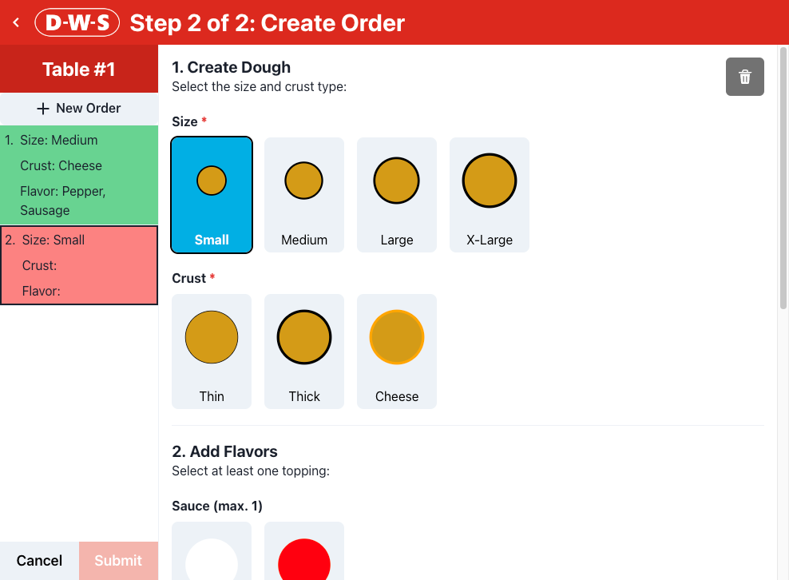

# dough-with-stuff



> React application that allows users to configure and place an order for `dough-with-stuff`.

## Tech Stack

- [React](https://react.dev/) as FE library
- [TypeScript](https://www.typescriptlang.org/) as language
- [Vite](https://vitejs.dev/) as build tool
- [Chakra UI](https://chakra-ui.com/) as component library
- [OpenAPI Typescript Codegen](https://github.com/ferdikoomen/openapi-typescript-codegen) as TypeScript-based client generator
- [Cypress](https://www.cypress.io/) as E2E test tool
- [Vercel](https://vercel.com/) as hosting platform
- [pnpm](https://pnpm.io/) as package manager

## Usage

- Install dependencies

```bash
pnpm install
```

- Manually set environment variables or create .env file in root folder

```bash
VITE_API_URL=<INSERT-URL-HERE>    // base API url
VITE_USE_DUMMY_API=               // set to non-empty string in case you want to mock API
```

- Run development server on port `1337`

```bash
pnpm dev
```

- Create production build

```bash
pnpm build
```

- Serve production build/static files

```bash
pnpm serve
```

## Containerize application

1. Build container

```bash
docker build -t dangpg/dough-with-stuff
```

2. Run container in interactive mode

```bash
docker run -it --rm -p 1337:1337 dangpg/dough-with-stuff
```

3. Production build is accessible at `http://localhost:1337`

## Any Decision Records

```
# Vite as React Framework

## Context

## Options

## Outcome
```

```
# TypeScript

## Context

## Options

## Outcome
```

```
# Chakra Ui as component library

## Context

## Options

## Outcome
```

```
# Eslint and Prettier

## Context

## Options

## Outcome
```

```
# openapi-typescript-codegen

## Context

## Options

## Outcome
```

```
# Global PizzaContext as state management solution

## Context

## Options

## Outcome
```
